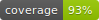
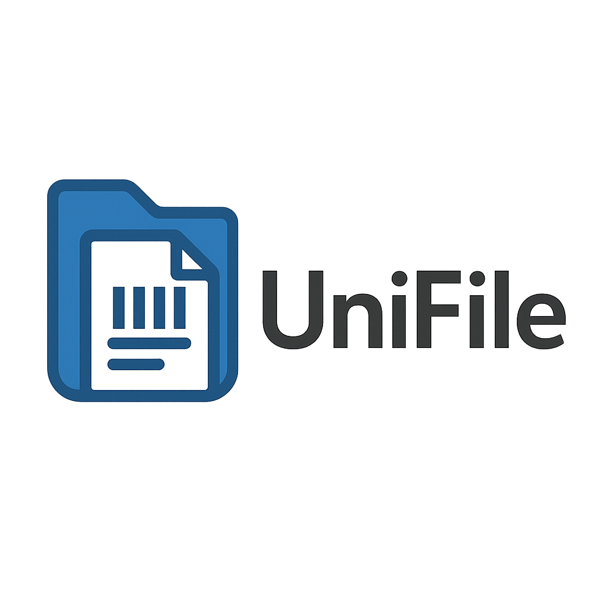
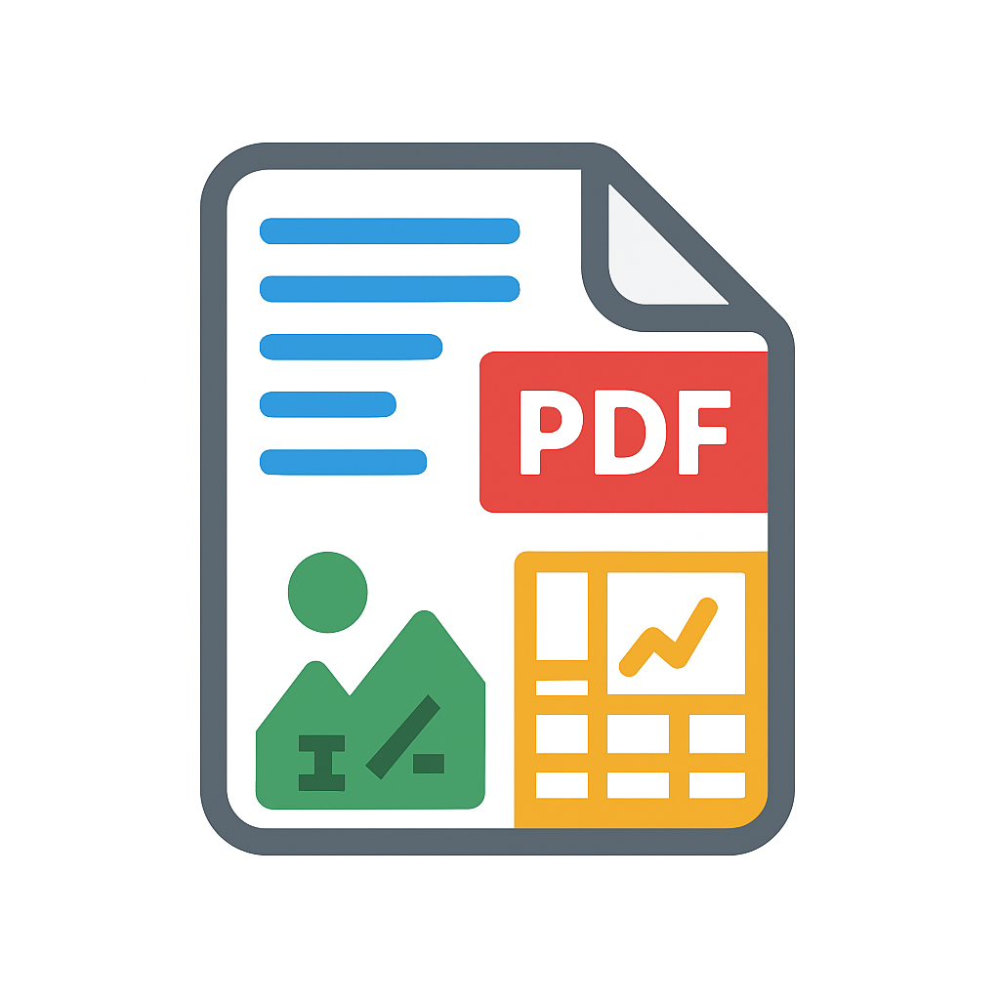
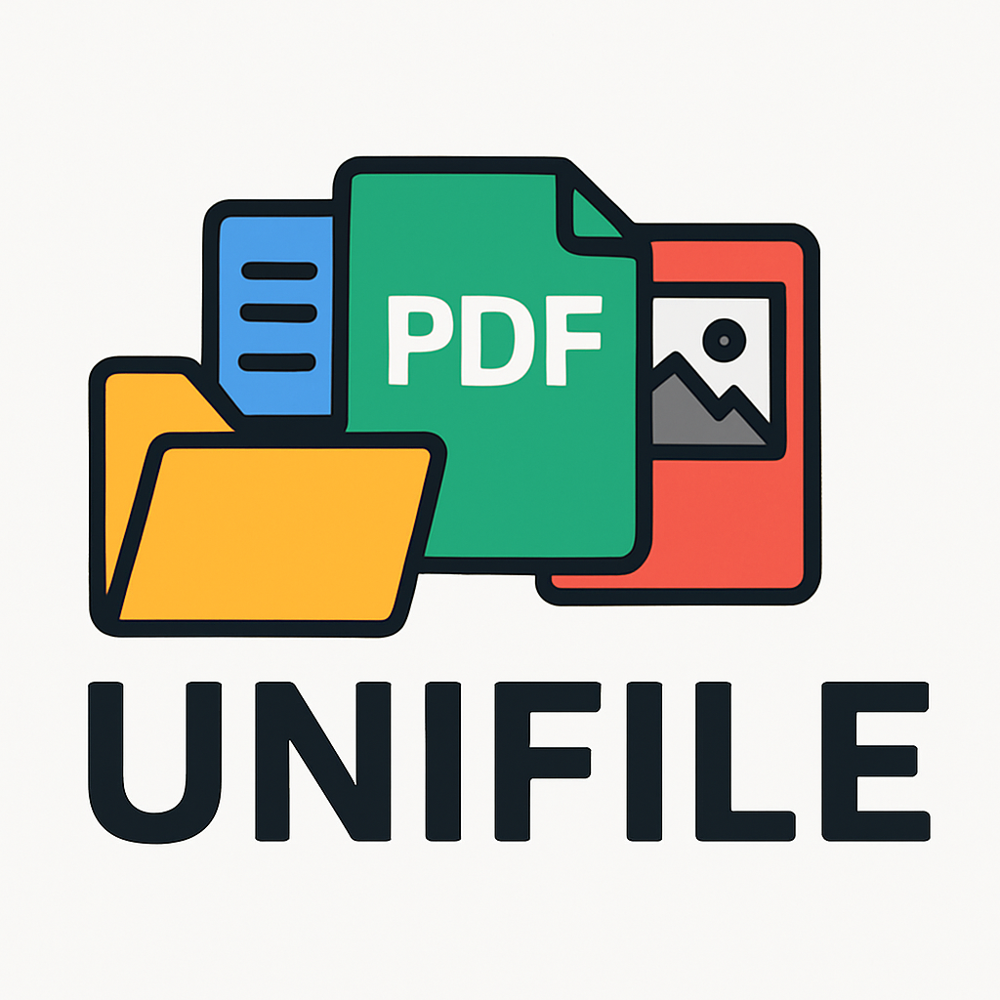

<!-- Copyright (c) 2025 takotime808 -->
# Unifile Extractor

[](https://takotime808.github.io/unifile_extractor/)

<!-- NOTE: This line is only for when the cicd commits the svg to main -->
<!--  -->


<!--  -->
<!--  -->

A tiny, pragmatic pipeline that ingests common file types (PDF, DOCX, PPTX, XLSX/CSV, TXT/MD/RTF, HTML, images like PNG/JPG)
and extracts text into a **standardized table**.

## Features
- **Single function**: `extract_to_table(path_or_bytes, filename=...) -> pandas.DataFrame`
- **File types**: PDF (with optional OCR fallback), DOCX, PPTX, XLSX/XLS, CSV/TSV, TXT/MD/RTF/LOG, HTML/HTM, PNG/JPG/TIFF/BMP/WebP/GIF (OCR).
- **Standardized schema**:

| column        | meaning |
|---------------|---------|
| `source_path` | Absolute/real path to the processed file |
| `source_name` | Basename of the file |
| `file_type`   | Extension/normalized type |
| `unit_type`   | Logical unit: `page`, `slide`, `sheet`, `table`, `image`, `file` |
| `unit_id`     | Index or name of the unit (`0`, `1`, `Sheet1`, `body`, `meta`) |
| `content`     | Extracted plain text |
| `char_count`  | Character count of `content` |
| `metadata`    | Dict with file/unit-specific metadata (JSON-serializable) |
| `status`      | `ok` or `error` |
| `error`       | Exception or notes when extraction fails |

## Install

```bash
python -m venv .venv && source .venv/bin/activate  # or your platform equivalent
pip install -r requirements.txt
```

> **OCR note** (images and scanned PDFs):
> This project uses [pytesseract](https://pypi.org/project/pytesseract/), which requires the Tesseract binary.
> - macOS: `brew install tesseract`
> - Ubuntu/Debian: `sudo apt-get install tesseract-ocr`
> - Windows: Install the Tesseract release from UB Mannheim builds and ensure it’s on PATH.

## Usage (Python)

### Python
```python
from unifile import extract_to_table

df = extract_to_table("/path/to/file.pdf")
print(df.head())            # standardized table
df.to_csv("out.csv", index=False)
```

### Bytes input (e.g., uploaded file)
```python
with open("/path/to/image.png", "rb") as f:
    data = f.read()

df = extract_to_table(data, filename="image.png")  # filename helps detect extension
```

### CLI demo (simple example)
```bash
python examples/quickstart.py /path/to/file.pdf --out table.csv
```

---

## CLI installation & usage

Install from source (editable dev mode):

```bash
pip install -e .
```

List supported types:
```bash
unifile list-types
```

Extract from a local file and print to stdout:
```bash
unifile extract ./docs/sources/_static/data/sample-engineering-drawing.pdf --max-rows 50 --max-colwidth 120
```

Extract from a URL and save to Parquet:
```bash
unifile extract "https://www.fastradius.com/wp-content/uploads/2022/02/sample-engineering-drawing.pdf" --out drawing.parquet
```

Disable PDF OCR fallback and set OCR language:
```bash
unifile extract ./scan.pdf --no-ocr --ocr-lang eng
```

Output formats supported by `--out`: `.csv`, `.parquet`, `.jsonl`.

---

## Design notes
- **PDF**: Uses PyMuPDF for native text; if a page yields empty text, tries OCR (configurable).
- **DOCX**: Reads paragraphs + table cells.
- **PPTX**: Walks slide shapes and collects `.text`.
- **XLSX/CSV**: For sheets/tables we serialize each row as tab-delimited lines.
- **HTML**: Uses BeautifulSoup to extract visible text; preserves block structure with newlines.
- **Text files**: Attempts encoding detection via `chardet`.

If you need more types (EML, EPUB, JSON, XML), add another extractor in `unifile/extractors/` and register its extension in `pipeline.py`.

## Minimal example

```python
from unifile import extract_to_table
df = extract_to_table("sample.docx")
df.to_parquet("sample.parquet", index=False)
```

## Limits & Tips
- OCR quality depends on image resolution; if a PDF page is image-only, we rasterize at 2x scale before OCR.
- Very large spreadsheets or PDFs can produce big `content` fields—consider postprocessing or chunking downstream.
- For HTML, you may wish to remove nav/boilerplate using heuristics like `readability-lxml` (not included).

---

MIT-like license (do whatever you want, no warranty).
